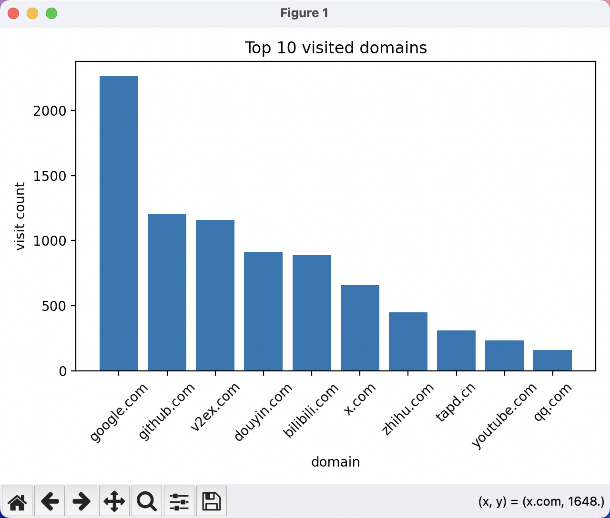

# Top 10 visited domains

copy `History` file to current directory and run `python main.py`

> chrome history file default path:
> 
> MacOS: `/Users/$USER/Library/Application Support/Google/Chrome/Default/History`
> 
> Windows: `C:\Users\<username>\AppData\Local\Google\Chrome\User Data\Default`

